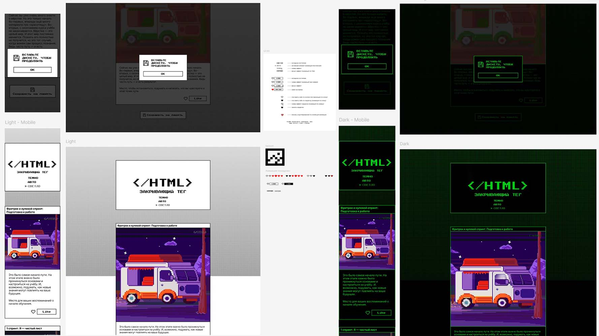

# zakrivayuschiy-teg-f
Проект "Закрывающий тег"
<<<<<<< HEAD
https://github.com/aidakhubaeva/zakrivayuschiy-teg-f.git
https://aidakhubaeva.github.io/zakrivayuschiy-teg-f/
=======
git@github.com:aidakhubaeva/zakrivayuschiy-teg-f.git

**"Zakrivayuschiy Teg"** is the final project in web layout development within the course, aimed at consolidating all previously learned skills. The project includes complex animations, adaptive design, color scheme switching, and interactive elements. The main goal is to create an interface fully compliant with the provided layout.

---

### What Was Done:

#### Completed Requirements:

- ✅ **General Requirements**:
  - All sections, blocks, and layout elements were implemented.
  - The project is displayed correctly in Firefox, Google Chrome, and Yandex Browser.
  - The layout is adapted for all screen sizes without horizontal scrolling.
  - The grid remains stable between breakpoints.
  - All interactive element states (`:hover`, `:focus-visible`, `:active`) were implemented.

- ✅ **Images and Fonts**:
  - Two fonts were connected: PressStart2P and the variable Inter font.
  - An adaptive SVG favicon changes color depending on the theme.
  - Unique CSS filters are applied to images on the page (at least one multiple filter).

- ✅ **Color Schemes**:
  - Light and dark themes were implemented with switching via `prefers-color-scheme`.
  - All colors and fonts are managed using CSS variables.
  - Color schemes modify the background, text, icons, and other elements.

- ✅ **Interactive Elements**:
  - All buttons and interactive elements have `:hover` and `:focus-visible` states.
  - A modal window was implemented using the `<dialog>` element.
  - Button animations include text and background color changes using `mix-blend-mode`.

- ✅ **Animations and Transformations**:
  - Smooth animations were implemented for menu arrows, buttons, and icons.
  - The "heart" icon animation includes color changes, scaling, and spark effects.
  - All animations were optimized for performance without interface glitches.

- ✅ **Modal Window**:
  - The modal window appears when clicking the "Save for Memory" button.
  - The modal's content is styled using reusable elements.

- ✅ **Adaptive Layout**:
  - Relative units like `clamp` were used.
  - The card and header layout were built with Flexbox and Grid.
  - A responsive design was implemented for mobile devices.

- ✅ **Labels and Filters**:
  - Labels with text and effects such as `mix-blend-mode` and `text-stroke` were added above card images.
  - `text-stroke` support was checked via `@supports`, with `text-shadow` used as a fallback.

---

### Deployment Instructions:
>>>>>>> aa91dea (Initial commit after fixing HEAD)
